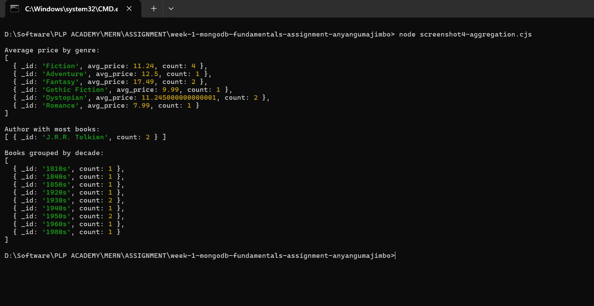

# 📚 MongoDB Fundamentals – Week 1 Assignment (PLP Academy)

**Author:** Majimbo Anyangu  
**Course:** MERN Stack – Backend Track  
**Database Used:** MongoDB (local instance)  
**Main File:** `queries.cjs`

---

## 🧠 Project Overview

This project demonstrates a strong grasp of MongoDB fundamentals through five key tasks. It includes:

- Inserting seed data into a collection
- Performing basic CRUD operations
- Executing advanced queries with projection, sorting, and pagination
- Using powerful aggregation pipelines for data analytics
- Applying indexing to optimize query performance

All queries were implemented in Node.js using the native MongoDB driver.

---

## 📁 File Structure

```bash
📦 project-folder
├── insert_books.js       # Inserts initial 12 book records
├── queries.cjs           # Contains all queries for Tasks 2–5
├── README.md             # This documentation
└── screenshots/          # Folder for embedded screenshots
```

---

## ⚙️ Setup Instructions

1. Ensure MongoDB is running locally (`mongodb://localhost:27017`).
2. Clone the repository and navigate to the project folder.
3. Install dependencies:
   ```bash
   npm install
   ```
4. Run the seed script:
   ```bash
   node insert_books.js
   ```
5. Run all queries:
   ```bash
   node queries.cjs
   ```

---

## ✅ Task Breakdown

### 📌 Task 1: Insert Books
- Script: `insert_books.js`
- Action: Inserts 12 sample books into the `books` collection in the `plp_bookstore` database.

📸 Screenshot:


---

### 🔍 Task 2: Basic CRUD Operations
- Find all books in the Fiction genre
- Find books published after 1950
- Find all books by George Orwell
- Update price of "The Great Gatsby" to 11.99
- Delete "Animal Farm" from the collection

📸 Screenshot:
  


---

### 🔎 Task 3: Advanced Queries
- Filter books that are in stock and published after 2010
- Use projection to return only `title`, `author`, and `price`
- Sort books by price in ascending and descending order
- Paginate to display page 2 with 5 books per page

📸 Screenshot:


---

### 📊 Task 4: Aggregation Pipeline
- Group books by genre to calculate the average price and count
- Determine the author with the most books
- Group books by publication decade (e.g., 1950s, 1980s)

Aggregation pipelines used: `$group`, `$sort`, `$concat`, `$floor`, `$toString`, `$match`

📸 Screenshot:


---

### 🚀 Task 5: Indexing & Optimization
- Create a simple index on the `title` field
- Create a compound index on `author` and `published_year`
- Use `.explain("executionStats")` to analyze query performance

📸 Screenshot:


### 🧪 Optional: MongoDB Compass views  
  
  

---

## 🧩 Concepts Demonstrated

- MongoDB CRUD commands via the native Node.js driver
- Aggregation pipeline design and transformation logic
- Efficient data retrieval using indexes
- Pagination for real-world application use
- Performance analysis with execution stats

---

## ✅ Final Notes

- This project uses CommonJS syntax (`.cjs`) for compatibility with Node.js v22+
- MongoDB driver version: ^6.17.0
- No third-party ODM libraries were used (e.g., Mongoose)
- All outputs were tested using `console.log()` and captured as screenshots

---

## 📦 Submission Checklist

- [x] insert_books.js completed
- [x] queries.cjs completed with all 5 tasks
- [x] README.md with embedded screenshots
- [x] Screenshots saved in /screenshots folder

